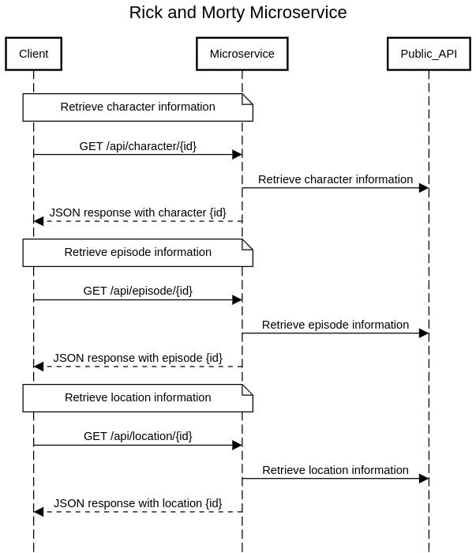

# Rick and Morty API Microservice
Cliff Bielinski  
CS361 Project  
Fall 2022

## About Microservice
This microservice is an API wrapper allowing client applications to get information about the show Rick and Morty. Specifically, clients can request information about the show's episodes, characters or locations through the API's endpoints. 

The microservice gets its information from an existing public API (https://rickandmortyapi.com/).

## Communication Contract
### How to REQUEST data
There are three exposed endpoints with which you can request data:
- /api/character/{id} for a specific character
- /api/location/{id} for a specific location
- /api/episode/{id} for a specific episode

Use an HTTP request with a GET method for any of these endpoints to request the desired data.

### How to RECEIVE data
- After calling an endpoint, the server will respond with a 200 status and send the desired data in JSON format. 

- In cases where the desired data is not found, the server will respond with a 404 status and a resource not found message.

- In cases where the endpoint is invalid, the server will respond with a 404 status and an invalid endpoint message.

- In all other cases where the server is unable to fulfill the request, the server will respond with a 500 status.

## UML Sequence Diagram

